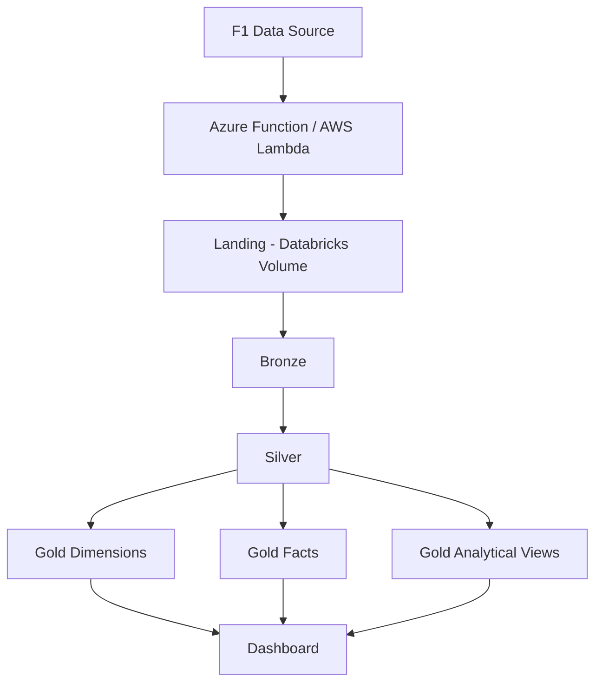

# Formula One
This project implements an end-to-end Formula 1 data engineering pipeline using Python, FastF1, and Databricks. Formula 1 data is extracted with the FastF1 library and stored locally in a landing layer before being processed through a Medallion Architecture in Databricks: Bronze for raw ingestion, Silver for data cleaning and transformation, and Gold for analytics-ready dimensional modeling using fact and dimension tables. The final layer supports an interactive Databricks dashboard with key Formula 1 performance metrics and insights.

# 🏎️ Formula 1 Lakehouse Analytics

## 1. Objetivo del proyecto

Construir una plataforma analítica de **Formula 1** utilizando una arquitectura **Medallion** sobre Databricks:

```text

Fuente de datos

      │

      ▼

   Landing

      │

      ▼

   Bronze

      │

      ▼

   Silver

      │

      ▼

    Gold

      │

      ▼

Dashboard / BI

```

El proyecto busca simular una arquitectura de datos real en la nube, separando claramente:

- adquisición de datos;

- almacenamiento raw;

- procesamiento incremental;

- limpieza y normalización;

- modelado analítico;

- consumo mediante dashboards.

---

## 2. Arquitectura general



La arquitectura sigue el patrón:

```text

Landing

  ↓

Bronze

  ↓

Silver

  ↓

Gold

  ↓

Dashboard

```

Cada capa tiene una responsabilidad diferente.

---

## 3. Landing Layer

### Objetivo

`landing` representa el punto de entrada de los archivos producidos por el sistema de ingesta.

En un entorno productivo, esta capa podría ser alimentada por:

- Azure Functions;

- AWS Lambda;

- pipelines;

- jobs programados;

- APIs externas.

En este proyecto, los archivos inicialmente pueden generarse localmente y cargarse al volumen para simular ese proceso.

---

### Estructura

Los datos se organizan utilizando particiones estilo Hive:

```text

landing/

│

├── events/

│   └── season=2025/

│       └── events.parquet

│

├── drivers/

│   └── season=2025/

│       └── drivers.parquet

│

├── constructors/

│   └── season=2025/

│       └── constructors.parquet

│

├── race_results/

│   └── season=2025/

│       ├── round=01/

│       │   └── race_results.parquet

│       ├── round=02/

│       │   └── race_results.parquet

│       └── round=03/

│           └── race_results.parquet

│

├── qualifying_results/

│   └── season=2025/

│       ├── round=01/

│       │   └── qualifying_results.parquet

│       └── ...

│

├── laps/

│   └── season=2025/

│       ├── round=01/

│       │   └── laps_results.parquet

│       └── ...

│

├── pit_stops/

│   └── season=2025/

│       ├── round=01/

│       │   └── pit_stops.parquet

│       └── ...

│

└── weather/

    └── season=2025/

        ├── round=01/

        │   └── weather_data.parquet

        └── ...

```

Para entidades relacionadas directamente con una carrera se utiliza:

```text

season=<year>/round=<round>/

```

Por ejemplo:

```text

landing/laps/season=2025/round=01/laps_results.parquet

```

La ventaja de esta estructura es que las particiones pueden derivarse directamente del path.

---

## 4. Convenciones de almacenamiento

### Temporada

```text

season=2025

```

### Carrera

```text

round=01

round=02

round=03

```

### Archivos

Los nombres pueden mantenerse legibles:

```text

race_results.parquet

qualifying_results.parquet

laps_results.parquet

pit_stops.parquet

weather_data.parquet

```

No es necesario incorporar `season` y `round` dentro del nombre porque esa información ya está contenida en el directorio.

---

## 5. Bronze Layer

### Objetivo

Bronze conserva los datos recibidos prácticamente sin transformaciones de negocio.

Su responsabilidad es:

- preservar el dato de origen;

- soportar re-procesamiento;

- mantener lineage;

- detectar nuevos archivos;

- permitir ingestión incremental;

- agregar metadata técnica.

Bronze **no debe contener lógica analítica compleja**.

---

### Tablas Bronze

```text

workspace.bronze.events

workspace.bronze.drivers

workspace.bronze.constructors

workspace.bronze.race_results

workspace.bronze.qualifying_results

workspace.bronze.laps

workspace.bronze.pit_stops

workspace.bronze.weather

```

`weather` puede existir en Bronze aunque inicialmente no sea promovido a Silver.

---

## 6. Metadata Bronze

Además de las columnas originales, cada registro conserva metadata como:

```text

\_source_file

\_source_file_name

\_source_file_size

\_source_file_modification_time

\_ingested_at

```

Y las particiones:

```text

season

round

```

cuando sean aplicables.

Esto permite conocer exactamente:

```text

dato

  ↓

archivo

  ↓

carrera

  ↓

temporada

  ↓

momento de ingestión

```

---

## 7. Ingestión incremental Bronze

La carga Bronze debe procesar únicamente archivos nuevos o modificados.

Conceptualmente:

```text

Landing

   │

   ├─ archivo ya procesado ───────────► ignorar

   │

   └─ archivo nuevo/modificado ───────► Bronze

```

Para detectar cambios se puede utilizar metadata como:

```text

\_source_file

\_source_file_modification_time

```

La función de ingestión puede seguir una interfaz similar a:

```python

ingest_bronze(

*entity*="race_results",

*partition_columns*=["season", "round"]

)

```

Para una entidad de temporada:

```python

ingest_bronze(

*entity*="events",

*partition_columns*=["season"]

)

```

---

## 8. Responsabilidades por capa

| Layer | Responsabilidad |
|---|---|
| Landing | Recibir archivos |
| Bronze | Preservar raw + metadata |
| Silver | Limpiar y estandarizar |
| Gold | Modelar para análisis |
| Dashboard | Presentar métricas |

Una regla importante del proyecto es:

```text

Landing = archivos

Bronze = datos raw confiables

Silver = entidades de negocio limpias

Gold = modelo analítico

```

---

## 9. Silver Layer

### Objetivo

Silver convierte el dato raw en entidades confiables de negocio.

Aquí se realizan:

- casting;

- normalización;

- deduplicación;

- estandarización de nombres;

- creación de IDs;

- manejo de nulls;

- selección de columnas útiles;

- cálculo de hashes;

- actualización incremental.

---

## 10. Metadata estándar Silver

Las tablas Silver incluyen metadata de lineage:

```text

source_entity

source_file

source_modified_at

bronze_ingested_at

record_hash

silver_updated_at

```

El propósito de `record_hash` es detectar si el contenido de un registro cambió.

Ejemplo conceptual:

```text

hash(column_1, column_2, column_3, ...)

```

Si:

```text

source key existe

AND

record_hash cambió

```

entonces el registro debe actualizarse.

---

## 11. Silver Tables

### `silver.races`

Representa el calendario de Grandes Premios.

Granularidad:

```text

1 fila = 1 carrera

```

Clave lógica:

```text

season + round

```

Información principal:

```text

season

round

country

location

official_event_name

event_name

event_date

event_format

```

Además puede conservar información sobre las diferentes sesiones del fin de semana.

---

### `silver.drivers`

Representa el maestro de pilotos.

Granularidad:

```text

1 fila = 1 piloto

```

Columnas principales:

```text

driver_id

driver_number

abbreviation

broadcast_name

first_name

last_name

full_name

country_code

headshot_url

```

Metadata:

```text

source_entity

source_file

source_modified_at

bronze_ingested_at

silver_updated_at

record_hash

```

---

### `silver.constructors`

Representa el maestro de equipos.

Granularidad:

```text

1 fila = 1 constructor

```

Columnas:

```text

constructor_id

constructor_name

team_color_hex

```

Metadata:

```text

source_entity

source_file

source_modified_at

bronze_ingested_at

record_hash

silver_updated_at

```

---

### `silver.race_results`

Representa el resultado de cada piloto en una carrera.

Granularidad:

```text

1 fila = piloto × carrera

```

Clave lógica:

```text

season

round

driver_id

```

Contiene información como:

```text

driver_id

constructor_id

starting_grid

finishing_position

classified_position

points

status

laps_completed

race_time

```

Esta es una de las tablas principales para el análisis del campeonato.

---

### `silver.qualifying_results`

Representa la clasificación de cada piloto.

Granularidad:

```text

1 fila = piloto × qualifying × carrera

```

Clave principal:

```text

season

round

driver_id

```

Información típica:

```text

position

q1_time

q2_time

q3_time

best_lap_time

```

Permite analizar:

- poles;

- posiciones de salida;

- rendimiento de clasificación;

- diferencia qualifying vs carrera.

---

### `silver.laps`

Representa cada vuelta completada por cada piloto.

Granularidad:

```text

1 fila = piloto × vuelta × carrera

```

Columnas base:

```text

season

round

driver_id

driver_number

constructor_id

lap_number

stint_number

```

Además puede contener:

```text

lap_time

sector_1_time

sector_2_time

sector_3_time

compound

tyre_life

position

speed

```

Es la tabla de mayor granularidad del modelo.

Permite análisis como:

```text

pace

fastest laps

stints

degradación

consistencia

comparaciones entre pilotos

```

---

### `silver.pit_stops`

Representa cada parada en pits.

Granularidad:

```text

1 fila = pit stop

```

Clave lógica aproximada:

```text

season

round

driver_id

stop_number

```

Información típica:

```text

season

round

driver_id

constructor_id

stop_number

lap_number

pit_duration

```

Permite analizar:

- cantidad de paradas;

- duración;

- vueltas de parada;

- estrategia;

- impacto del pit stop.

---

## 12. Weather

Los datos meteorológicos existen inicialmente en:

```text

landing

   ↓

bronze.weather

```

pero en esta fase del proyecto **no se crea aún** `silver.weather`****.

Esto permite mantener el dato disponible para incorporarlo posteriormente sin complicar prematuramente el modelo Silver.

---

## 13. Flujo Bronze → Silver

Cada tabla Silver se alimenta principalmente de una entidad Bronze.

```text

bronze.events

     ↓

silver.races

bronze.drivers

     ↓

silver.drivers

bronze.constructors

     ↓

silver.constructors

bronze.race_results

     ↓

silver.race_results

bronze.qualifying_results

     ↓

silver.qualifying_results

bronze.laps

     ↓

silver.laps

bronze.pit_stops

     ↓

silver.pit_stops

```

La metadata permite mantener trazabilidad hacia Landing.

---

## 14. Estrategia incremental Silver

Silver debe procesar únicamente datos nuevos o modificados.

Patrón:

```text

Bronze

   │

   ▼

Transform

   │

   ▼

Calculate record_hash

   │

   ▼

MERGE

```

Lógica conceptual:

```sql

WHEN MATCHED

AND target.record_hash <> source.record_hash

THEN UPDATE

WHEN NOT MATCHED

THEN INSERT

```

Esto evita reconstruir tablas completas innecesariamente.

---

## 15. Gold Layer

### Objetivo

Gold está diseñado específicamente para consumo analítico.

A diferencia de Silver, Gold ya puede:

- unir entidades;

- calcular métricas;

- desnormalizar información;

- construir dimensiones;

- construir hechos;

- crear vistas orientadas al dashboard.

---

## 16. Modelo dimensional

El modelo Gold sigue un esquema estrella.

```text

                   dim_driver

                       │

                       │

dim_constructor ─── fact_race_result ─── dim_race

                       │

                       │

                 fact_qualifying

                       │

                       │

                    fact_lap

                       │

                       │

                 fact_pit_stop

```

---

## 17. Dimensiones Gold

### `gold.dim_driver`

Fuente:

```text

silver.drivers

```

Granularidad:

```text

1 fila = piloto

```

Campos:

```text

driver_id

driver_number

abbreviation

first_name

last_name

full_name

country_code

headshot_url

```

---

### `gold.dim_constructor`

Fuente:

```text

silver.constructors

```

Granularidad:

```text

1 fila = constructor

```

Campos:

```text

constructor_id

constructor_name

team_color_hex

```

---

### `gold.dim_race`

Fuente:

```text

silver.races

```

Granularidad:

```text

1 fila = carrera

```

Clave:

```text

season + round

```

Campos principales:

```text

season

round

country

location

event_name

official_event_name

event_date

event_format

```

---

## 18. Fact Tables

### `gold.fact_race_result`

Fuente principal:

```text

silver.race_results

```

Granularidad:

```text

1 piloto × 1 carrera

```

Relacionada con:

```text

dim_driver

dim_constructor

dim_race

```

Medidas:

```text

points

starting_grid

finishing_position

laps_completed

```

---

### `gold.fact_qualifying`

Fuente:

```text

silver.qualifying_results

```

Granularidad:

```text

1 piloto × 1 carrera

```

Medidas:

```text

qualifying_position

q1_time

q2_time

q3_time

best_qualifying_time

```

---

### `gold.fact_lap`

Fuente:

```text

silver.laps

```

Granularidad:

```text

1 piloto × 1 vuelta × 1 carrera

```

Medidas:

```text

lap_time

sector_1_time

sector_2_time

sector_3_time

stint_number

tyre_life

```

---

### `gold.fact_pit_stop`

Fuente:

```text

silver.pit_stops

```

Granularidad:

```text

1 pit stop

```

Medidas:

```text

pit_duration

lap_number

stop_number

```

---

## 19. Gold Analytical Views

Además del modelo estrella, se crean vistas orientadas directamente al dashboard.

La idea es evitar que la herramienta BI tenga que reconstruir lógica compleja.

---

### `gold.vw_championship_standings`

Objetivo:

Mostrar el campeonato de pilotos.

Fuentes:

```text

fact_race_result

dim_driver

```

Métricas:

```text

total_points

wins

podiums

races_completed

average_finish

```

Uso:

```text

Driver Championship

```

---

### `gold.vw_constructor_standings`

Objetivo:

Mostrar el campeonato de constructores.

Fuentes:

```text

fact_race_result

dim_constructor

```

Métricas:

```text

total_points

wins

podiums

```

Uso:

```text

Constructor Championship

```

---

### `gold.vw_race_results`

Objetivo:

Mostrar el resultado completo de una carrera.

Incluye:

```text

race

driver

constructor

grid_position

finish_position

positions_gained

points

status

```

Uso:

```text

Race Results

```

---

### `gold.vw_driver_season_summary`

Objetivo:

Resumen completo por piloto.

Granularidad:

```text

1 piloto × temporada

```

Métricas:

```text

points

wins

podiums

poles

fastest_laps

average_finish

average_grid

DNFs

```

Uso:

```text

Driver Performance

```

---

### `gold.vw_constructor_season_summary`

Objetivo:

Resumen de temporada por constructor.

Métricas:

```text

points

wins

podiums

average_finish

DNFs

```

---

### `gold.vw_qualifying_performance`

Objetivo:

Analizar rendimiento en clasificación.

Campos:

```text

driver

constructor

race

qualifying_position

best_time

```

Métricas derivadas:

```text

average_qualifying_position

pole_count

```

---

### `gold.vw_lap_performance`

Objetivo:

Analizar ritmo de carrera.

Granularidad:

```text

driver × lap

```

Información:

```text

lap_number

driver

constructor

lap_time

stint_number

compound

tyre_life

```

Uso:

```text

race pace chart

lap comparison

stint analysis

```

---

### `gold.vw_fastest_laps`

Objetivo:

Obtener la vuelta más rápida de cada piloto por carrera.

Métricas:

```text

fastest_lap

fastest_lap_number

gap_to_fastest

```

---

### `gold.vw_pit_stop_analysis`

Objetivo:

Analizar las paradas en pits.

Métricas:

```text

number_of_stops

average_pit_duration

fastest_pit_stop

total_pit_time

```

---

### `gold.vw_position_changes`

Objetivo:

Comparar salida contra llegada.

Cálculo:

```text

positions_gained =

starting_grid - finishing_position

```

Permite identificar:

```text

mayor ganancia de posiciones

mayor pérdida de posiciones

performance desde la parrilla

```

---

## 20. Lineage completo

Ejemplo para vueltas:

```text

F1 API

   │

   ▼

laps_results.parquet

   │

   ▼

landing/laps/season=2025/round=01/

   │

   ▼

workspace.bronze.laps

   │

   ▼

workspace.silver.laps

   │

   ▼

workspace.gold.fact_lap

   │

   ▼

workspace.gold.vw_lap_performance

   │

   ▼

Dashboard

```

Para resultados:

```text

race_results.parquet

       │

       ▼

bronze.race_results

       │

       ▼

silver.race_results

       │

       ▼

gold.fact_race_result

       │

       ├── vw_championship_standings

       ├── vw_constructor_standings

       ├── vw_race_results

       ├── vw_driver_season_summary

       └── vw_position_changes

```

---

## 21. Catálogos y schemas

La organización lógica en Databricks es:

```text

workspace

│

├── bronze

│   ├── events

│   ├── drivers

│   ├── constructors

│   ├── race_results

│   ├── qualifying_results

│   ├── laps

│   ├── pit_stops

│   └── weather

│

├── silver

│   ├── races

│   ├── drivers

│   ├── constructors

│   ├── race_results

│   ├── qualifying_results

│   ├── laps

│   └── pit_stops

│

└── gold

    ├── dim_driver

    ├── dim_constructor

    ├── dim_race

    │

    ├── fact_race_result

    ├── fact_qualifying

    ├── fact_lap

    ├── fact_pit_stop

    │

    ├── vw_championship_standings

    ├── vw_constructor_standings

    ├── vw_race_results

    ├── vw_driver_season_summary

    ├── vw_constructor_season_summary

    ├── vw_qualifying_performance

    ├── vw_lap_performance

    ├── vw_fastest_laps

    ├── vw_pit_stop_analysis

    └── vw_position_changes

```


Esto es preferible a tener un único notebook enorme porque permite ejecutar, probar y mantener cada entidad de forma independiente.

---

## 22. Pipeline completo

El pipeline final conceptualmente sería:

```text

                  INGESTION

                     │

                     ▼

          Azure Function / Lambda

                     │

                     ▼

                  LANDING

                     │

                     ▼

             Bronze ingestion

                     │

                     ▼

                  BRONZE

                     │

                     ▼

            Silver transformations

                     │

                     ▼

                  SILVER

                     │

                     ▼

               Gold model

                     │

                     ▼

                   GOLD

                     │

                     ▼

              SQL Warehouse

                     │

                     ▼

               Dashboard

```

---

## 23. Ejemplo de ejecución

Cuando llega una nueva carrera:

```text

season=2025

round=04

```

se agregan archivos como:

```text

landing/race_results/season=2025/round=04/race_results.parquet

landing/qualifying_results/season=2025/round=04/qualifying_results.parquet

landing/laps/season=2025/round=04/laps_results.parquet

landing/pit_stops/season=2025/round=04/pit_stops.parquet

```

Después:

```text

1\. Bronze detecta archivos nuevos.

2\. Bronze carga únicamente esos archivos.

3\. Silver identifica registros nuevos/modificados.

4\. Silver realiza MERGE.

5\. Gold incorpora los nuevos resultados.

6\. Las vistas Gold reflejan automáticamente la carrera.

7\. El dashboard muestra la información actualizada.

```

No es necesario reconstruir toda la temporada.

---

## 24. Principios del diseño

### Idempotencia

Ejecutar nuevamente un pipeline no debe duplicar datos.

```text

same input

    ↓

same output

```

---

### Incrementalidad

Procesar únicamente:

```text

new records

+

changed records

```

en lugar de reconstruir todo el dataset.

---

### Lineage

Cada registro Silver debe poder rastrearse hasta:

```text

Silver

  ↓

Bronze

  ↓

Landing file

```

---

### Separación de responsabilidades

No colocar lógica de dashboard dentro de Bronze o Silver.

```text

Bronze → technical ingestion

Silver → business-clean data

Gold → analytics

```

---

### Grain explícito

Cada tabla debe tener una granularidad claramente definida.

Ejemplos:

```text

races

1 fila = carrera

race_results

1 fila = piloto × carrera

laps

1 fila = piloto × vuelta × carrera

pit_stops

1 fila = parada

```

La granularidad es uno de los elementos más importantes para evitar duplicaciones al construir métricas.

---

## 25. Resumen de arquitectura

```text

                         FORMULA 1 LAKEHOUSE

                                  │

                                  ▼

┌───────────────────────────────────────────────────────────────┐
│ LANDING                                                       │
│                                                               │
│ Parquet                                                       │
│ season=YYYY / round=NN                                        │
└──────────────────────────────┬────────────────────────────────┘

                               │

                               ▼

┌───────────────────────────────────────────────────────────────┐
│ BRONZE                                                        │
│                                                               │
│ Raw data                                                      │
│ Source metadata                                               │
│ Incremental ingestion                                         │
└──────────────────────────────┬────────────────────────────────┘

                               │

                               ▼

┌───────────────────────────────────────────────────────────────┐
│ SILVER                                                        │
│                                                               │
│ Clean                                                         │
│ Typed                                                         │
│ Deduplicated                                                  │
│ Standardized                                                  │
│ record_hash                                                   │
│ MERGE                                                         │
└──────────────────────────────┬────────────────────────────────┘

                               │

                               ▼

┌───────────────────────────────────────────────────────────────┐
│ GOLD                                                          │
│                                                               │
│ Dimensions                                                    │
│ Facts                                                         │
│ Analytical Views                                              │
└──────────────────────────────┬────────────────────────────────┘

                               │

                               ▼

┌───────────────────────────────────────────────────────────────┐
│ DASHBOARD                                                     │
│                                                               │
│ Championship                                                  │
│ Race Analysis                                                 │
│ Driver Performance                                            │
│ Pit Strategy                                                  │
└───────────────────────────────────────────────────────────────┘

```

---

## 26. Resultado final

El proyecto implementa una arquitectura Lakehouse en la que:

```text

Landing

```

recibe los archivos originales.

```text

Bronze

```

los almacena de forma confiable y trazable.

```text

Silver

```

los transforma en entidades de negocio limpias.

```text

Gold

```

construye el modelo analítico.

Y finalmente:

```text

Gold

   ↓

Dashboard

```

permite analizar el campeonato, los pilotos, constructores, carreras, clasificación, ritmo de carrera y estrategia de pits.

La arquitectura está diseñada para que agregar una nueva carrera implique únicamente añadir nuevos datos a Landing y ejecutar el pipeline incremental, sin tener que reconstruir manualmente el histórico.

